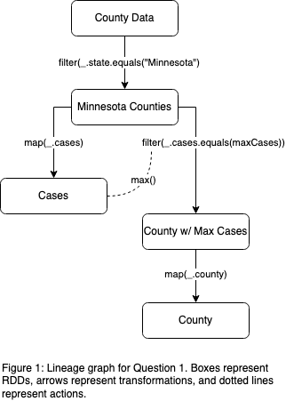
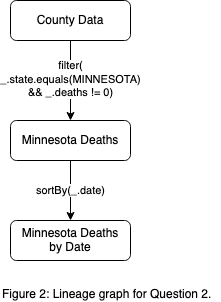
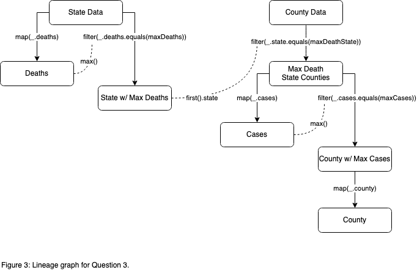
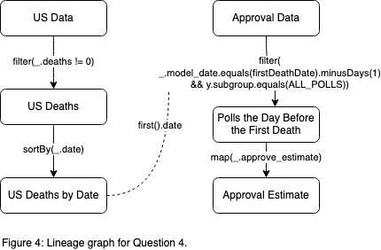
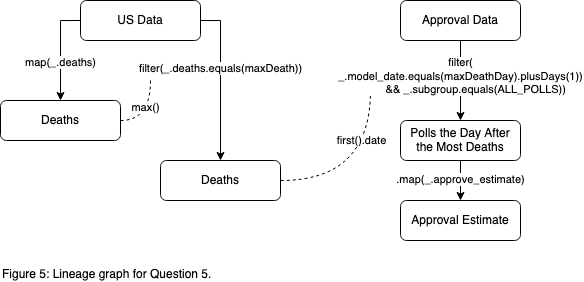

# Spark Project

The only data cleaning required for this project was updating 
the `approval-topline.model_date` format (`MM/dd/yyyy -> yyyy-MM-dd`)
to facilitate sorting.

## Question 1

>Which county in Minnesota has the most reported Covid-19 cases 
>(as of April 25)?

Extracting the answer to Question 1 required *iterative transformations* 
to the`us-counties` dataset, which were performed by invoking methods 
on the `UsCounties` object, as seen in Figure 1.

To improve performance, a filtered RDD was derived from `UsCounties`
so that Spark would store the partitions of counties related to Minnesota
in memory, speeding up subsequent computations. This first step was also
desirable because only a fraction of the `UsCounties` data was loaded 
into memory. In a production environment, this finer-grained read 
would prevent records from being loaded into RAM.

Once the "County Data" was filtered down to "Minnesota Counties," that
RDD was used in two computations:

1. Applying a map and running `max()` to get the highest number of 
cases in a Minnesota county.
2. Separately, applying a further filter (using the max value found above) 
and map before running `collect()` to get the name of the county with the
most Covid-19 cases.

In a production environment, the Spark scheduler would pipeline these
transformations to the nodes with the cached partitions of county data.

## Question 2

>Which county in Minnesota was the first to report a Covid-19 death?

Arriving at the answer to Question 2 was relatively simple:
"Minnesota Deaths" is a filtered RDD derived from `UsCounties`, as
seen in Figure 2. At this point, Spark would pull the death data 
into memory, and send the instruction to apply a sort by date on the
partitioned data before running `first()` to get the 
first county in Minnesota to report a Covid-19 death.

## Question 3

>In the state with the most reported Covid-19 deaths (as of April 25), 
>which county has the most Covid-19 cases?

Question 3 has two parts: determining the state with the most Covid-19 
deaths; and finding the county in that state with the most cases.
Once a couple of coarse-grained transformations have been applied to 
the filtered RDD derived from `UsStates` to determine the state with 
the most Covid-19 deaths in the country, the process for answering the 
second half of the question is identical to the process for Question 1, 
except instead of filtering `UsCounties` on "Minnesota," the state 
is determined by running `first().state` on "State w/ Max Cases."

## Question 4

>What was Trump’s approval rating in the round of polls directly before 
>the US reported its first Covid-19 death?

Same basic flow: filtered RDDs pulled into memory, transformations
applied to the partitioned data, actions run to derive intermediate
values and results.

## Question 5

>What was Trump’s approval rating in the round of polls directly 
>following the US reporting its highest number of Covid-19 deaths (as of April 25)?

Three-part flow, as depicted in Figure 5: filtered RDDs pulled into memory, 
transformations applied to the partitioned data, 
actions run to derive intermediate values and results.

