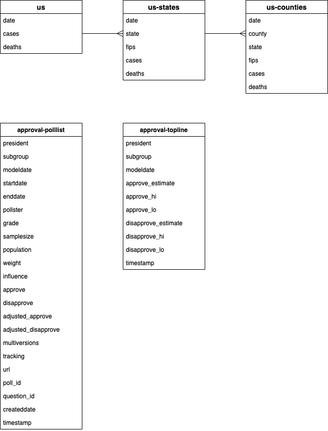

# Spark Project Proposal

I propose an analysis of [Covid-19 data](https://github.com/nytimes/covid-19-data) 
that the [New York Times](https://www.nytimes.com/news-event/coronavirus) has made
publicly available, and [presidential approval ratings](https://projects.fivethirtyeight.com/trump-approval-ratings) 
aggregated by FiveThirtyEight, using the Spark RDD API.

## Data

The table below provides an overview of the datasets that I’d like to analyze. 
The first three are the daily number of Covid-19 cases and deaths at 
the nation-, state-, and county-levels, as reported by the New York Times. 
The final two datasets are presidential approval ratings aggregated from 
multiple polls by FiveThirtyEight — the focus will be on the top-line 
data, but the poll list is included for reference.

| Dataset | Size | Format | Summary |
|:--------|:-----|:-------|:--------|
| us-counties | 2.5 MB | CSV | date,county,state,fips,cases,deaths |
| us-states | 75 KB | CSV | date,state,fips,cases,deaths |
| us | 2 KB | CSV | date,cases,deaths |
| approval-polllist | 2.9 MB | CSV | References to all the polling data that is used to calculate the topline. |
| approval-topline | 377 KB | CSV | model_date,approve_estimate,disapprove_estimate |

Please find the diagrams at the end of this document for a visual 
representation of the datasets, including a complete list of 
approval-polllist and approval-topline attributes.

## Questions

The table below outlines my proposed analytic questions and possible 
technical approaches to finding the answers. I have formulated these 
approaches under the assumption that I will be able to use the 
Resilient Distributed Dataset (RDD) API. RDD is the basic abstraction 
in Spark, but it is sufficiently powerful to answer these questions, 
and I’d like more practice using it.

| No. | Question | Approach |
|:----|:---------|:---------|
| 1 | Which county in Minnesota has the most reported Covid-19 cases (as of April 25)? | Filter the us-counties dataset to records where the `state` is equal to “Minnesota,” then find the max from `cases`, and return the `county` value. |
| 2 | Which county in Minnesota was the first to report a Covid-19 death? | Filter the us-counties dataset to records where the `state` is equal to “Minnesota" and order the records by `date`, then find the first record where `deaths` is not equal to 0, and return the `county` value. |
| 3 | In the state with the most reported Covid-19 deaths (as of April 25), which county has the most Covid-19 cases? | Join the us-states and us-counties datasets on `state` values. Find the max `deaths` from the us-states dataset. Filter the us-counties dataset by that state to find the max `deaths`, and return the `county` value. |
| 4 | What was Trump’s approval rating in the round of polls directly before the US reported its first Covid-19 death? | Join on `us.date` and `approval-topline.modeldate`. Order the us dataset by `date` and find the first record where `deaths` is not equal to 0. Then, find the record where `model_date` is one day before the date of the first reported US Covid-19 death, and the `subgroup` is “All polls.” Return the `approve_estimate` value. |
| 5 | What was Trump’s approval rating in the round of polls directly following the US reporting its highest number of Covid-19 deaths in a day (as of April 25)? | Join on `us.date` and `approval-topline.modeldate`. Find the max from `us.deaths`. Then, find the record where the `model_date` one day after, and the `subgroup` is “All polls.” Return the `approve_estimate` value. |

## Diagrams

